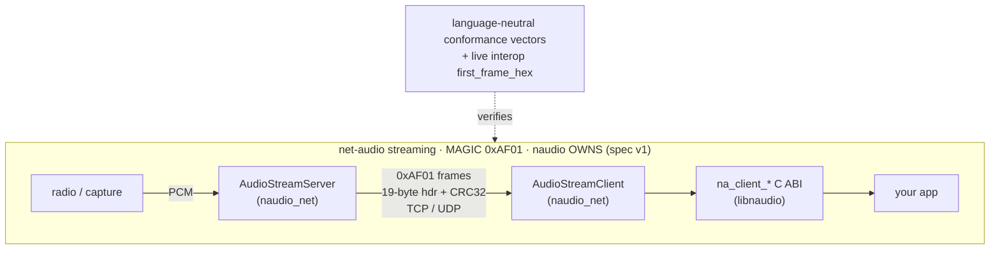

# naudio — the `0xAF01` network-audio wire format

naudio carries one wire format: the **net-audio audio-streaming protocol**, magic `0xAF01`. Its
job is to move radio **audio** over a network — a versioned, CRC-checked frame format with a
reliability stack (jitter / FEC / reorder / ARQ) that naudio **owns** and freezes at spec v1.

```
                  naudio — net-audio audio-streaming protocol
                  ===========================================

 ┌─────────────────────────────────────────────────────────────────────────────┐
 │ net-audio audio-streaming protocol                       MAGIC = 0xAF01     │
 │ naudio OWNS this · frozen at spec v1 · job: move radio AUDIO over a network │
 │                                                                             │
 │     radio / capture                                                         │
 │          │ PCM                                                              │
 │          ▼                                                                  │
 │   ┌───────────────────┐   0xAF01 frames        ┌───────────────────┐        │
 │   │ AudioStreamServer │──(19-byte hdr+CRC32)──▶│ AudioStreamClient │        │
 │   │   (naudio_net)    │      TCP / UDP         │   (naudio_net)    │        │
 │   └───────────────────┘                        └─────────┬─────────┘        │
 │       codec = naudio_core                                │                  │
 │       (AudioPacket 0xAF01 +                              ▼                  │
 │        jitter/FEC/reorder/ARQ)                   na_client_*  (C ABI,       │
 │                                                  libnaudio) ──▶ your app    │
 │                                                                             │
 │   VERIFIED BY:  conformance golden vectors  (language-neutral)              │
 │                 + live interop (first_frame_hex=68c569c6…)                  │
 └─────────────────────────────────────────────────────────────────────────────┘
```

## Same graph in Mermaid (renders on GitHub / VS Code / Obsidian)



## At a glance

| | net-audio audio-streaming protocol |
|---|---|
| **Magic** | `0xAF01` (2-byte frame magic) |
| **Job** | move radio audio over the network |
| **Owner** | **naudio** (frozen spec v1) |
| **Transport** | TCP / UDP sockets (server ↔ clients) |
| **naudio code** | `naudio_core` (codec) + `naudio_net` (server/client) + `na_client_*` C ABI |
| **Verified by** | conformance golden vectors + live interop (`first_frame_hex`) |

## Reliability stack — accepted limitations (R1, R3, R4)

The `0xAF01` reliability primitives (jitter / FEC / reorder / ARQ) carry a few edge-boundary
behaviors. **R3** and **R4** follow from the **protocol's own definitions** — they are properties of
the frozen `0xAF01` wire contract, not implementation bugs — so they are **documented rather than
"fixed"**: changing either behavior would diverge from the frozen wire. **R1** is a *defensive bound*
naudio adds over a latent unbounded loop in the literal protocol definition; it changes no observable
behavior within the realistic sequence regime (or any conformance vector), only the pathological
out-of-range case. They are recorded here so consumers understand the edge boundaries.

### R3 — Sequence numbers do not wrap (`PacketReorderBuffer`)

The packet sequence number is a **32-bit** field (a signed `int32` on the wire, compared as
`uint32`). The reorder buffer tracks a monotonically increasing "next expected" sequence and has **no
rollover handling**: when a single connection's sequence counter reaches 2³² it wraps to 0, the
buffer treats the wrapped-low sequence as far in the past, and the stream **dropouts permanently**
until the connection is re-established (a reconnect resets the sequence baseline).

- **Why it's accepted:** 2³² packets at the default ~20 ms framing (~50 packets/s) is **~2.7 years of
  continuous, never-reconnecting single-connection streaming** — unreachable in practice, since any
  disconnect/reconnect resets the counter. Widening the field or adding wrap arithmetic is a wire
  change (a v2 protocol decision), not a v1 fix.
- **Mitigation if ever needed:** reconnect (the auto-reconnect path already resets the baseline).

### R4 — XOR-FEC single-loss recovery emits at block-max length (`FecDecoder`)

The forward-error-correction scheme is **XOR parity over a block**: when exactly one audio packet in a
block is missing and the parity packet arrives, the lost packet is reconstructed by XOR-ing the parity
against the surviving members. Because XOR operates over the **widest** payload in the block, a packet
recovered this way is emitted at the **block-max payload length**, not its original length. For
**variable-length** payloads, a recovered packet can therefore be longer (zero-padded) than the
packet that was lost.

- **Why it's accepted:** this is **inherent to XOR block FEC** — the parity word has no per-member
  length, so a single-loss reconstruction cannot recover the original length. naudio's audio frames
  are **fixed-size** (`bytesPerFrame`) within a stream, so in the audio path every block member is the
  same width and the recovered length is correct; the limitation only bites a hypothetical
  variable-length payload type.
- **Mitigation if ever needed:** carry an explicit per-packet length, or restrict FEC to fixed-size
  frames (the current audio usage already satisfies this).

### R1 — `forceFlush` silence-gap fill is bounded (defensive)

When the reorder buffer gives up on an unfillable gap (window full or hold timeout), it
`forceFlush()`es: it emits one silence gap (a NULL packet) for each *missing* sequence between the
next-expected and the highest buffered sequence, then the buffered packets in order. The span between
those two sequences is **peer-/corruption-controlled** — a single packet with an out-of-range sequence
number (or R3's no-wrap horizon) makes that span up to ~2³². A naive implementation that iterated that
raw integer span would emit ~2 billion silence frames for such a packet — effectively a
denial-of-service hang.

naudio's `PacketReorderBuffer::forceFlush` **caps the silence-gap run to `windowSize`**: it walks the
buffered packets in sorted order (never the raw integer span) and emits at most `windowSize` NULL gaps
per flush; beyond the cap it treats the hole as a stream discontinuity and jumps `nextExpected` past
it, still emitting every buffered packet. The buffered packets and the `packetsReordered` accounting
are unchanged — only the silence-gap count is bounded.

- **Why it's safe:** every conformance vector and every realistic loss burst is far below `windowSize`
  gaps (the window/timeout flushes long before a gap that large), so within the realistic regime the
  bounded output is **byte-identical** to the unbounded definition. The cap only changes the
  pathological out-of-range span, where the unbounded loop would hang rather than produce a meaningful
  stream.
